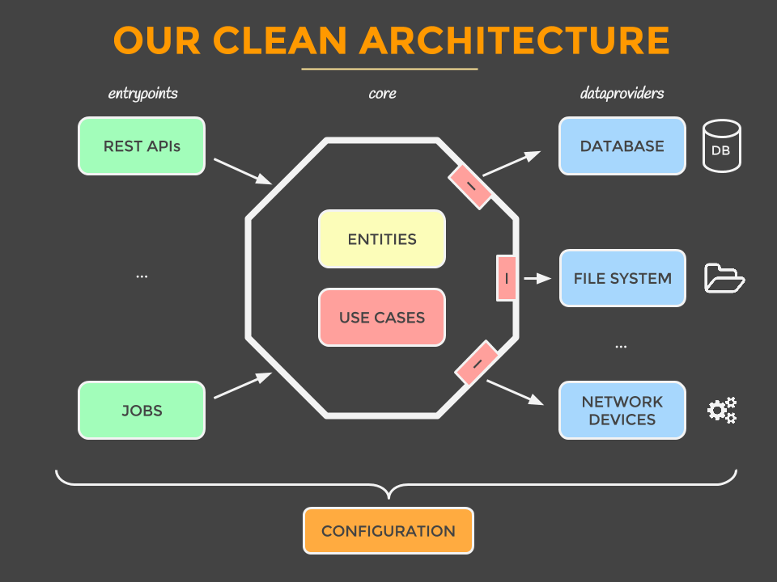
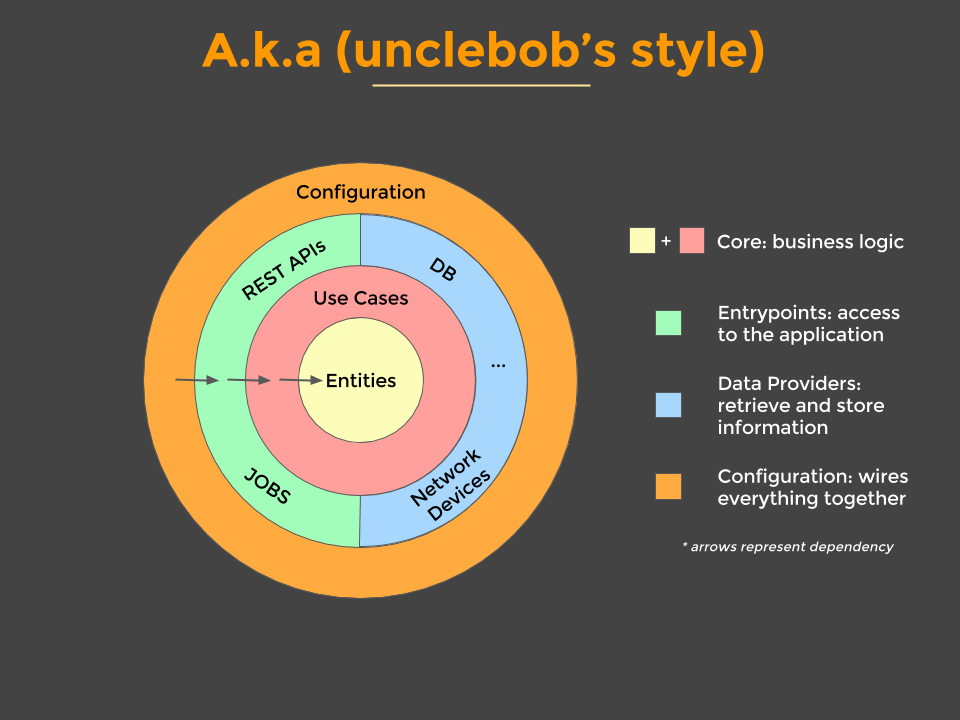
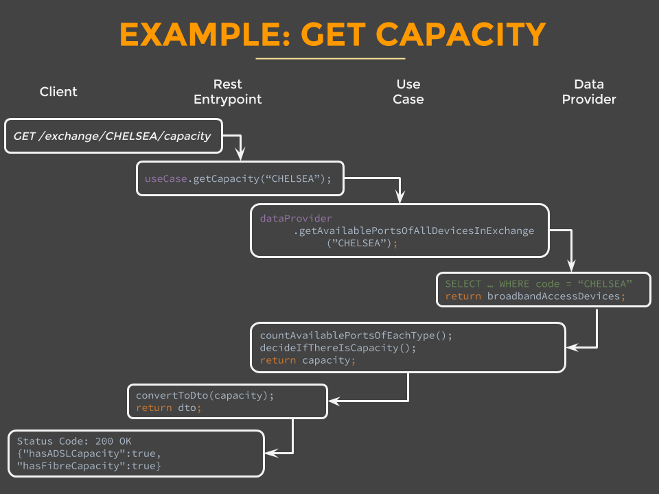
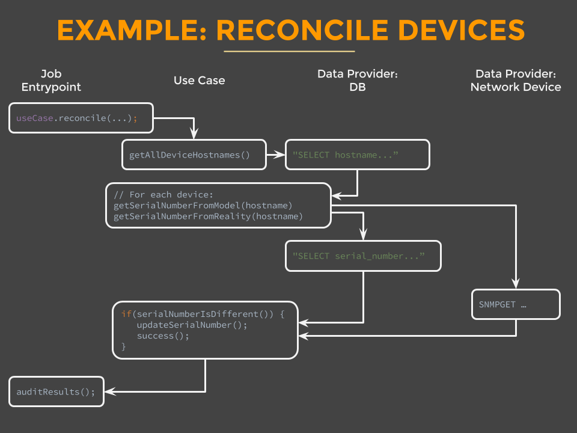
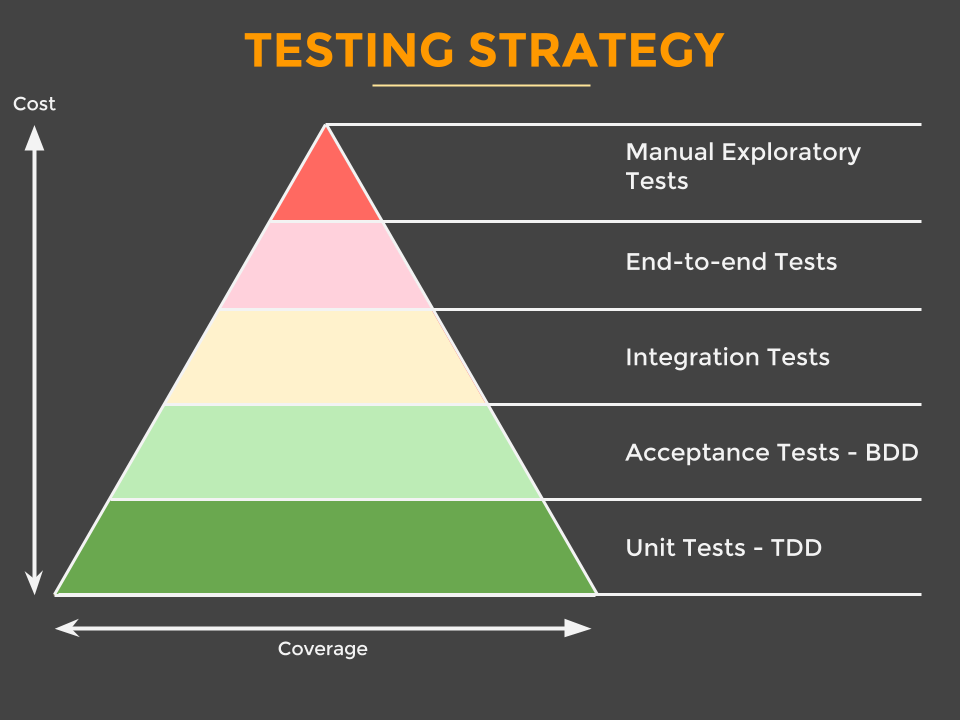
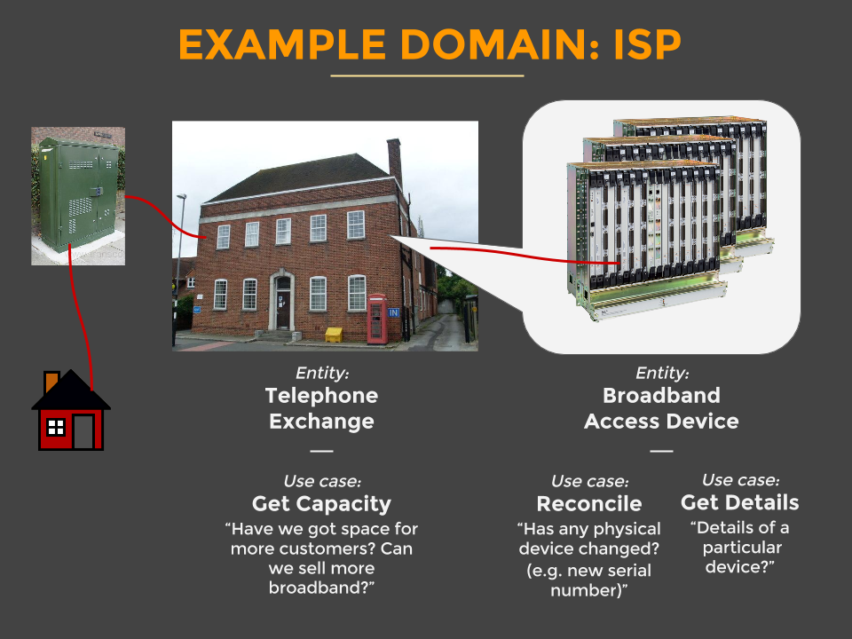

# clean-architecture-example
This is an example project to show what Clean Architecture would look like (in Go).

It follows the origin [the Java implementation](https://github.com/mattia-battiston/clean-architecture-example),which was originally created to go together with [this presentation](http://www.slideshare.net/mattiabattiston/real-life-clean-architecture-61242830)

**Table of Contents**
* [Why Clean Architecture?](#why-clean-architecture)
* [Application Structure](#application-structure)
* [Testing Strategy](#testing-strategy)
* [Building and Running the application](#building-and-running-the-application)
* [The example domain](#the-example-domain)
* [Resources](#resources)
* [Contacts](#contacts)

***

## Why Clean Architecture?
> The center of your application is not the database. Nor is it one or more of the frameworks you may be using. **The center of your application is the use cases of your application**  -  _Unclebob_ ([source](https://blog.8thlight.com/uncle-bob/2012/05/15/NODB.html "NODB"))

Clean architecture helps us solve, or at least mitigate, these common problems with architecture:
* **Decisions are taken too early**, often at the beginning of a project, when we know the least about the problem that we have to solve
* **It's hard to change**, so when we discover new requirements we have to decide if we want to hack them in or go through an expensive and painful re-design. We all know which one usually wins. _The best architectures are the ones that allow us to defer commitment to a particular solution and let us change our mind_
* **It's centered around frameworks**. Frameworks are tools to be used, not architectures to be conformed to. Frameworks often require commitments from you, but they don’t commit to you. They can evolve in different directions, and then you’ll be stuck following their rules and quirks
* **It's centered around the database**. We often think about the database first, and then create a CRUD system around it. We end up using the database objects everywhere and treat everything in terms of tables, rows and columns
* **We focus on technical aspects** and when asked about our architecture we say things like “it’s servlets running in tomcat with an oracle db using spring”
* **It's hard to find things** which makes every change longer and more painful
* **Business logic is spread everywhere**, scattered across many layers, so when checking how something works our only option is to debug the whole codebase. Even worse, often it's duplicated in multiple places
* **Forces/Encourages slow, heavy tests**. Often our only choice for tests is to go through the GUI, either because the GUI has a lot of logic, or because the architecture doesn't allow us to do otherwise. This makes tests slow to run, heavy and brittle. It results in people not running them and the build beind broken often
* **Infrequent deploys** because it's hard to make changes without breaking existing functionalities. People resort to long-lived feature branches that only get integrated at the end and result in big releases, rather than small incremental ones

Clean architecture gives us all these benefits:
* **Effective testing strategy** that follows the [testing pyramid](http://martinfowler.com/bliki/TestPyramid.html) and gives us a fast and reliable build
* **Frameworks are isolated** in individual modules so that when (not if) we change our mind we only have to change one place, with the rest of the app not even knowing about it
* **Independent from Database**, which is treated just like any other data provider. Our app has real use cases rather than being a CRUD system
* **Screaming architecture** a.k.a. it screams its intended usage. When you look at the package structure you get a feel for what the application does rather than seeing technical details
* **All business logic is in a use case** so it's easy to find and it's not duplicated anywhere else
* **Hard to do the wrong thing** because modules enforce compilation dependencies. If you try to use something that you're not meant to, the app doesn't compile
* **We're always ready to deploy** by leaving the wiring up of the object for last or by using feature flags, so we get all the benefits of continuous integration (no need for feature branches)
* **Swarming on stories** so that different pairs can easily work on the same story at the same time to complete it quicker
* **Good monolith** with clear use cases that you can split in microservices later one, once you've learnt more about them

Of course, it comes at a cost:
* **Perceived duplication of code**. Entities might be represented differently when used in business logic, when dealing with the database and when presenting them in a json format. You might feel like you're duplicating code, but you're actually favouring _decoupling over DRY_
* **You need interesting business logic** to "justify" the structure. If all you do in your use case is a one-line method to read or save from a database, then maybe you can get away with something simpler

***

## Application Structure




##### Core: Entities
* Represent your domain object
* Apply only logic that is applicable in general to the whole entity (e.g. validating the format of an hostname)
* Plain java objects: no frameworks, no annotations

##### Core: Use Cases
* Represent your business actions, it’s what you can do with the application. Expect one use case for each business action
* Pure business logic, plain java (expect maybe some utils libraries like StringUtils)
* Define interfaces for the data that they need in order to apply some logic. One or more dataproviders will implement the interface, but the use case doesn’t know where the data is coming from
* The use case doesn't know who triggered it and how the results are going to be presented (e.g. could be on a web page, or returned as json, or simply logged, etc.)
* Throws business exceptions

##### Dataproviders
* Retrieve and store data from and to a number of sources (database, network devices, file system, 3rd parties, etc.)
* Implement the interfaces defined by the use case
* Use whatever framework is most appropriate (they are going to be isolated here anyway)
* Note: if using an ORM for database access, here you'd have another set of objects in order to represent the mapping to the tables (don't use the core entities as they might be very different)

##### Entrypoints
* Are ways to interact with the application, and typically involve a delivery mechanism (e.g. REST APIs, scheduled jobs, GUI, other systems)
* Trigger a use case and convert the result to the appropriate format for the delivery mechanism
* A GUI would use MVC (or MVP) in here; the controller would trigger a use case

##### Configuration
* Wires everything together
* Frameworks (e.g. for dependency injection) are isolated here
* Has the "dirty details" like Main class, web server configuration, datasource configuration, etc.

##### _Examples_




***

## Testing Strategy


##### Unit Tests
* for TDD (a.k.a. Tests first, to drive design)
* Cover every little detail, aim for 100% coverage
* “Dev to dev” documentation: What should this class do?
* Test individual classes in isolation, very fast

##### Acceptance Tests
* for BDD (a.k.a. Conversations with the stakeholders)
* Demonstrate and document business requirements
* “Business” documentation: What does the system do?
* Test a use case in isolation, very fast (no GUI, no DB, etc.)
* Use your favourite BDD framework (we use [Yatspec](https://github.com/bodar/yatspec))

##### Integration Tests
* Test integration with slow parts (http, database, etc.)
* “Dev” documentation: Does this work as expected?
* Test one layer in isolation (e.g. only rest endpoint, or only data provider). Slow
* Use whatever library makes it easy (e.g. Spring MockMVC; in-memory db)

##### End-to-end Tests
* Test only the critical journeys (e.g. most common happy path)
* Demonstrate “business” end-to-end requirement
* Start the whole app, very slow. Keep these to a minimum

***

## Building and Running the application
* install dependencies
```
go get github.com/golang/mock/gomock
go get github.com/golang/mock/mockgen
go get github.com/DATA-DOG/godog/cmd/godog
go get gopkg.in/DATA-DOG/go-sqlmock.v1
go get github.com/mattn/go-sqlite3
```
* testing the application:
```
cd acceptance-tests/businessrequirements/exchange && godog
cd application/core/usecase && go test ./...
```
* running the application (on the fly):
```
cd application/configuration && go run app.go
curl -X GET http://localhost:8000/exchange/exch1/capacity
```

Once the application is running, you can:
* open <http://localhost:8080/broadbandaccessdevice/device1.exlon.com/> and you should see some json
* look at the log and you should see a scheduled job running every 5 seconds (it prints something like _"Job Starting: ReconcileBroadbandAccessDeviceJob..."_)

***

## The example domain


This example application is a simplified version of a real production application that we develop at Sky. The domain is a telecommunication domain. It's a Network Inventory software that has the fulfill the following use cases:
* Capacity of an exchange: how much available space have we got in a particular exchange? can we take on more customers in that area?
* Reconcile devices: has anything changed in reality that we don't know of?
* Get details of a particular device, by hostname

***

## Resources

##### Presentation
* Real Life Clean Architecture http://www.slideshare.net/mattiabattiston/real-life-clean-architecture-61242830

##### Blogs & Articles
* The Clean Architecture https://blog.8thlight.com/uncle-bob/2012/08/13/the-clean-architecture.html
* Screaming Architecture http://blog.8thlight.com/uncle-bob/2011/09/30/Screaming-Architecture.html
* NODB https://blog.8thlight.com/uncle-bob/2012/05/15/NODB.html
* Hexagonal Architecture http://alistair.cockburn.us/Hexagonal+architecture

##### Videos & Presentations
* Clean Coders ep. 7: Architecture, Use Cases, and High Level Design https://cleancoders.com/episode/clean-code-episode-7/show
* Robert C. Martin - Clean Architecture https://vimeo.com/43612849
* Robert C. Martin - Clean Architecture and Design https://www.youtube.com/watch?v=Nsjsiz2A9mg

***